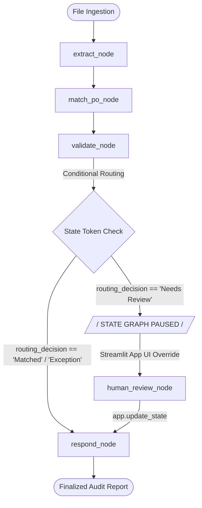

# 📋 Autonomous Enterprise Invoice Auditing & 3-Way Match Agent

An AI-native corporate financial compliance and auditing agent framework built using **LangGraph**, **OpenAI GPT-4o**, **Docling**, and **ChromaDB**. This system automates the classical accounting **Verification Triangle**—cross-referencing unstructured vendor invoices against structural Purchase Orders (PO contracts) and Warehouse Goods Receipt Notes (GRN logs) to instantly block over-billing, identity tampering, and duplicate payment fraud while supporting seamless Human-in-the-Loop (HITL) state overrides.

---

## 🎯 Architectural Overview & Core Capabilities

Traditional enterprise resource planning (ERP) auditing layers fail when confronted with unstructured formats (PDFs, scrambled layout tables, or smartphone images of invoices). This project transitions traditional static checks into an **Autonomous Graph Topology** that addresses three major pitfalls in modern LLM/RAG systems:

1. **Hybrid Multimodal Ingestion (Docling + Vision):** Native multi-page text documents (`.pdf`, `.docx`) are ingested using Docling's high-fidelity structural layout parser to preserve structural markdown layout matrices. Static images (`.png`, `.jpg`) completely bypass brittle local CPU OCR engines and are routed into **GPT-4o's Native Multimodal Vision track** via Base64 payloads to eliminate character-dropping.
2. **Alphanumeric Filter-Hardened Two-Pass RAG:** Overcomes vector semantic collisions (e.g., embedding models confusing `PO-101` and `PO-110` due to close proximity tokens) by utilizing an isolated candidate retrieval pool combined with exact string identity matching filters. Includes a two-pass lookup chain to dynamically uncover missing PO tokens on raw layout documents using vendor metadata.
3. **Immutable State Mutation Checkpointing:** Solves LangGraph conditional edge routing memory loss by writing routing determinations dynamically into the persistent state graph via a `MemorySaver` checkpointer. High-risk actions natively trigger execution halts, exposing state mutations (`app.update_state`) to the frontend Streamlit UI for manual review.

---

## 📊 System Architecture Graph



---

## 🛠️ The 3-Way Match Fraud Guardrail Matrix

The system implements strict deterministic business rules across the validation layer to isolate anomalies:

* **Arithmetic Integrity Check:** Verifies if `Quantity × Unit Price = Stated Item Line Total` for every single extracted item.
* **Header-Level Over-Billing Guardrail:** Cross-references the overall Invoice Stated Total against the sum of the line items *and* the contracted PO total amount independently to detect hidden phantom fees or surcharge injections.
* **Fulfillment Leak Prevention:** Flags violations if the invoice quantity exceeds the warehouse actual receipt counts (GRN), or if the warehouse accepts quantities exceeding the original PO contract ceiling.
* **Registry Duplicate Tracker:** Blocks duplicate submissions of any invoice payload that has already successfully passed the system registry check to thwart multi-billing exploits.

---

## 📁 Repository Structure

```text
├── data/
│   ├── invoices/               # Evaluator batch evaluation test files (.pdf, .png, .docx)
│   └── uploads/                # Directory for active UI runtime session uploads
├── chroma_db/                  # Localized vectorized persistent database index
├── app.py                      # StateGraph compilation, retry layouts, and workflow routing rules
├── nodes.py                    # Implementation of Graph Nodes (extract, match, validate, human, respond)
├── schemas.py                  # Strict Pydantic Data Contract Specifications (AgentState, ExtractedInvoice)
├── streamlit_app.py            # Streamlit Presentation Frontend UI Dashboard
├── demo_run.py                 # Pure console-based automated batch validation script
├── requirements.txt            # System dependency declarations
└── README.md                   # System Architecture Documentation
```

---

## ⚡ Mock Data Benchmark Reference Matrix

Use these data pairings pre-indexed inside your vector database instance to execute system evaluations and demonstrate specific behavioral features:

| Invoice ID | File Format | Target PO | Target GRN | Stated Total | Targeted Validation Boundary Scenario | System Outcome |
| :--- | :--- | :--- | :--- | :--- | :--- | :--- |
| **INV-001** | `.pdf` | `PO-101` | `GRN-101` | \$5,000.00 | Baseline Flawless 3-Way Match Tracking. | **MATCHED** |
| **INV-003** | `.png` | `PO-10